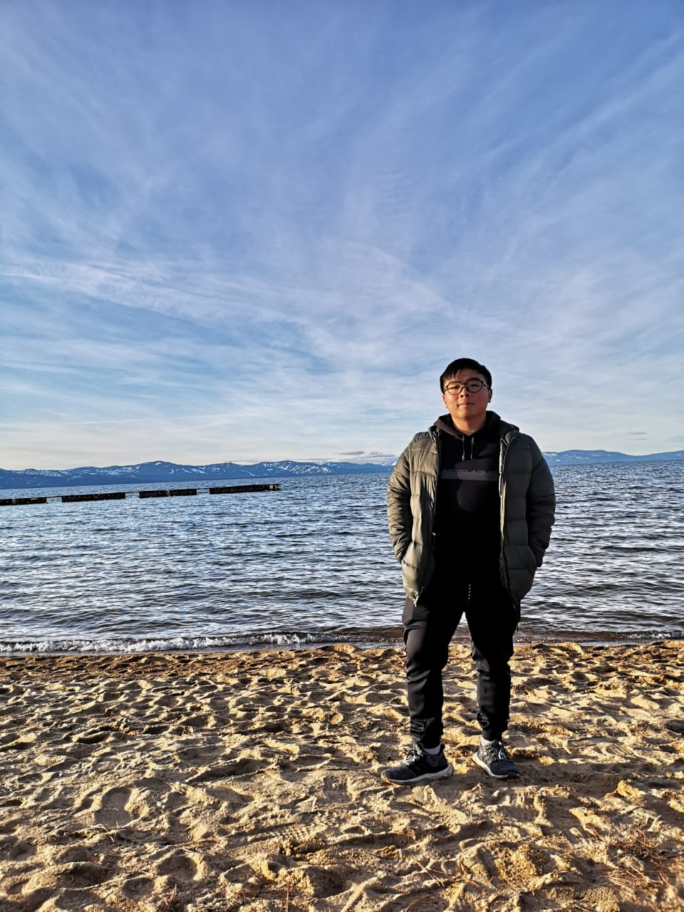

# Hello there!
**I'm Dante, a UCSD student majoring in computer science.** 
>My passion lies in full-stack development!



## Preferred Programming Languages
1. Javascript/Typescript
2. Python
3. Java
4. C++
5. C
```
Tools I've used:
1. ReactJS (React Native)
2. Selenium Web Scraping
3. PostgreSQL
4. GraphQL
5. Postman
```
### Fun facts about me:
- My home country is Jakarta, Indonesia
- I have 4 dogs and 1 cat, [Pics here](images/IMG-20220925-WA0001.jpg)
- I play pc and nintendo switch games

### Bucketlist of SWE experiences:
- [x] Full-Stack Dev
- [x] Quality-Assurance Engineer
- [ ] Computer-System Engineer
- [ ] Web Dev


To see more, [click here](https://www.linkedin.com/in/matthieu-dante-pardin-099588172/) to check out my LinkedIn!


[Go back to the top of the page](#Hello-there!)